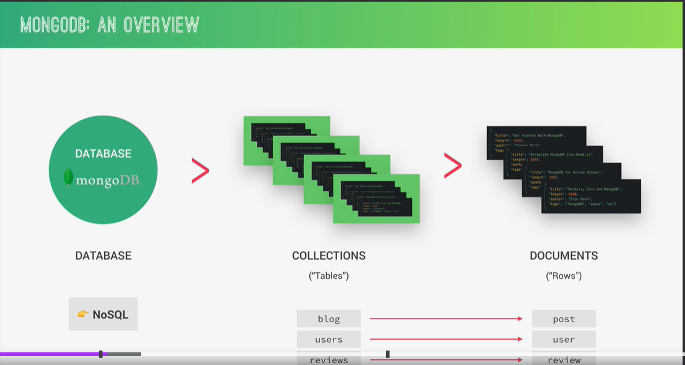
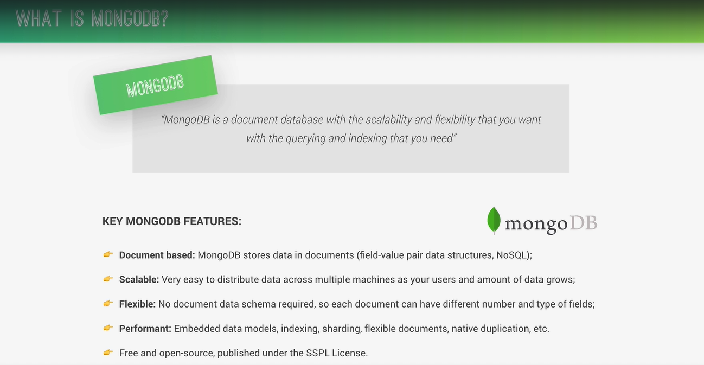
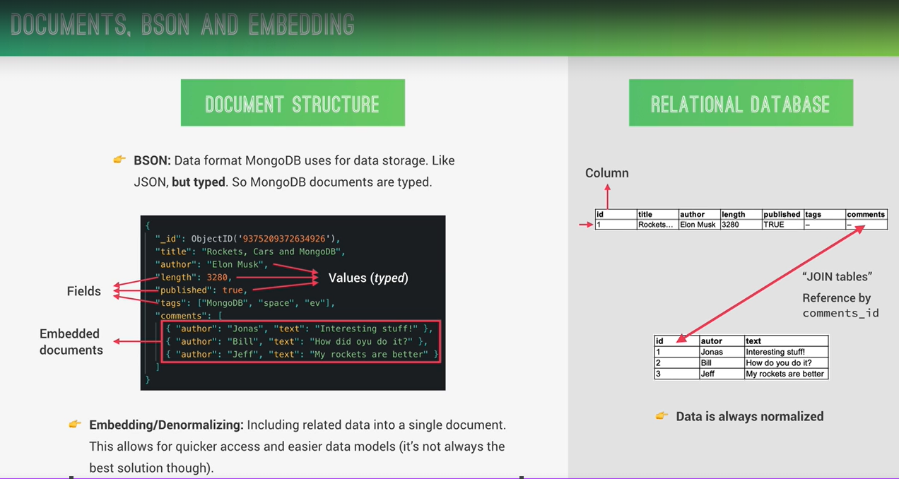
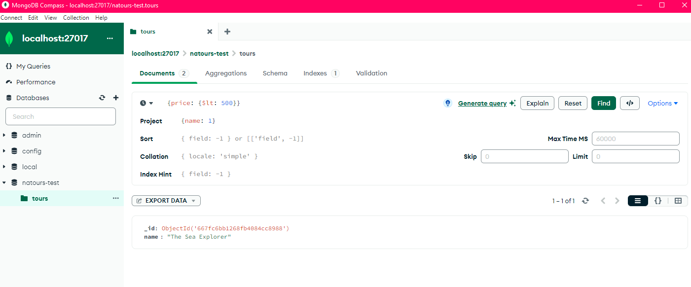
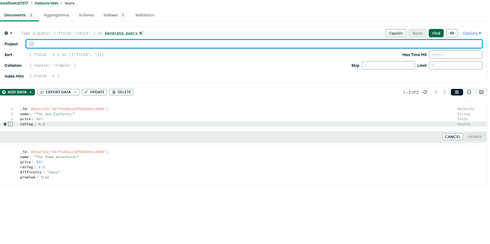
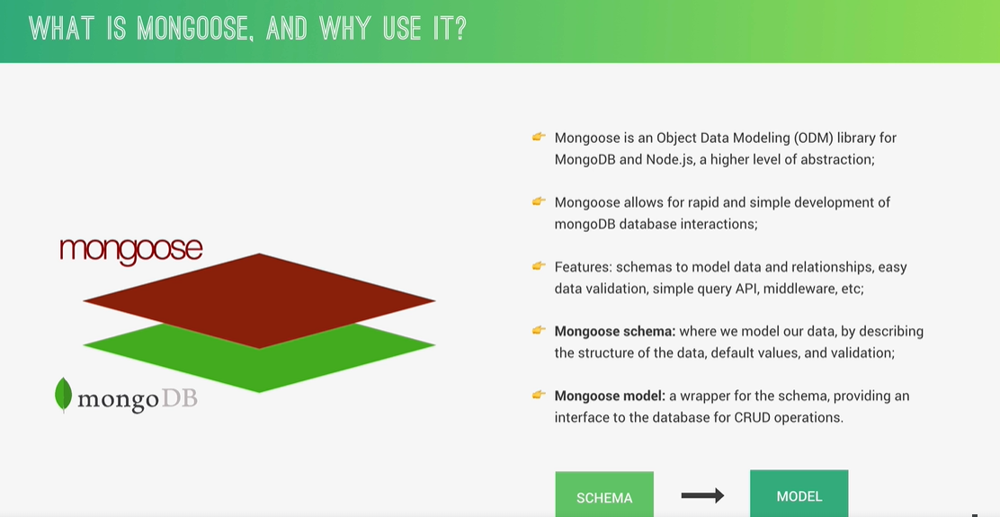

# Using-MongoDB

Current max size of each socument is 16 Mega Bytes (MB)
Each docuemnt has a Id, which is unique identifier for that document and it get created automatically when we create document.

## Setting for starting mongodb server from any directory

setting - type 'env' in search bar - select first option 'Edit the system environment variables' - from advanced tab click on 'Environment Variables.' button - then select path from system variables and click on edit button - now click on new button and add node directory path 'C:\Program Files\MongoDB\Server\7.0\bin', after that click on ok button - now run the mondodb server using command prompt - mongod.exe

Starting mongo db server - mongod
Starting mongosh shell - mongosh
Creating or switching databases - use db_name
Creating document - db.tours.insertOne({name:"The Forest Hiker", price: 297, rating: 4.7})
Getting documents - db.tours.find()
Getting all available databases - show dbs
Getting all available collections - show collections
Exiting from mongosh shell - quite()
Creating multiple documents simultaneously - db.tours.insertMany([{name: "The Sea Explorer", price: 497, rating: 4.8}, {name:"The Snow Adventurer", price: 997, rating: 4.9, difficulty: "easy"}])

## Find if matches certain conditions

Field values are always case sensitive.

db.tours.find({name: "The Forest Hiker"})

db.tours.find({price: {$lte: 500}}) --- Using less than or equal to operator

db.tours.find({price: {$lte: 500}, rating: {$gte: 4.8}}) --- Searching for multiple conditions --- AND

db.tours.find({$or: [ {price: {$lte: 500}}, {rating: {$gte: 4.8}} ]}) --- Searching for multiple conditions --- OR

db.tours.find({$or: [ {price: {$gt: 500}}, {rating: {$gte: 4.8}} ]}, {name: 1}) --- Getting only specific fields from the document, here want to get name field of filtered documents

db.tours.updateOne({ name: "The Forest Hiker" }, { $set: { price: 900 }}) --- Update first document which satisfies the condition

db.tours.updateMany({ price: {$gt: 500}, rating: {$gt: 4.7} }, {$set: { premium: true } } ) --- Update all documents which satisfies given condition

db.tours.replaceOne( { name: "The Forest Hiker" }, { name: "The Forest Hiker!", price: 450, rating: 3.5 } ) --- Replaces whole document which matches given condition

updateOne() or updateMany() can update just a parts of document
replaceOne() update whole document

db.tours.deleteOne( { rating: {$lt: 3.9} } ) --- Delete first document which matches given

db.tours.deleteMany( { rating: {$lt: 3.9} } ) --- Delete all documents which matches given condition

## Using compass

## Using Atlas

It is a remote database on a service called Atlas, which is owned by the same team that develops MongoDB.
First create a new project
Then create a cluster, cluster is an instance of our database.

## Connecting Atlas with database i.e. with Compass and Mongosh

Check lecture 81 - Connecting to our Hosted Database

## Mongoose

Mongoose is an Object Data Modeling (ODM) library for MongoDB and Node.js, a higher level of abstraction.
Express is a layer of abstraction over a regular Node, while Mongoose is a layer of abstration over a regular MongoDB driver.

